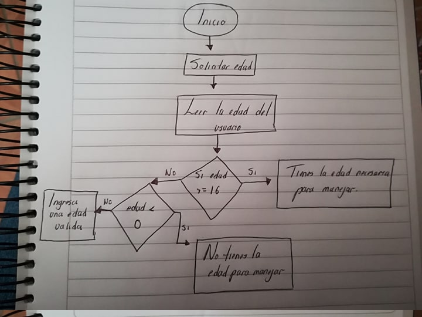

### Cómo resolver un problema
1. Entender el problema
2. Identificar entradas, procesos y salidas
3. Dibujar el diagrama de flujo
4. Escribir el algoritmo en pseudocodigo
5. Escribir el código en Atom
1. Entender el problema: Requerimientos, declaración y salida ejemplo.

#### Entender el problema
Escribe un programa que le pregunte al usuario por su edad y la compare con la edad legal para manejar que es de 16. Si el usuario tiene 16 años o es mayor, el programa debe decirle "Tienes la edad necesaria para manejar". Si el usuario es menor de 16 años, el programa debe mostrar "No tienes la edad para manejar, ¡eres un bebé!"

#### Entradas, proceso y salidas
##### Sustantivos:
* edad del ususario (entrada)
* edad legal
* Mensaje mostrado (salida)
##### Verbos:
* preguntar
* comparar
* mostrar

#### Dibujar diagrama de flujo (Al final de la página)

#### Algoritmo en Pseudocódigo

Inicializar edadUsuaeio a “”  

Si edadUsuario >= que 16 = "Tienes la edad necesaria para manejar"
Si edadUsuario <= que 0 = "No tienes la edad para manejar, ¡eres un bebé!"
Si edadUsuario < que 0 = "Please, bitch ingresa una edad válida XD"
