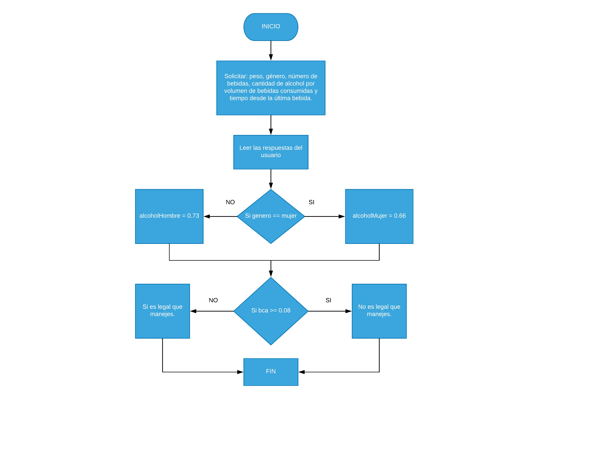

#### Entender el problema: Requerimientos, declaración y salida ejemplo.

Crea un programa que solicite tu peso, género, número de bebidas, la cantidad de alcohol por volumen de bebidas consumidas y la cantidad de tiempo desde tu última bebida. Calcula la cantidad de alcohol en tu sangre (BCA) usando la siguiente formula.

##### Salida ejemplo
Tu cantidad de alcohol es 0.08, no es legal que manejes.

#### Entradas, proceso y salidas
##### Sustantivos:
* peso (entrada)
* género (entrada)
* número de bebidas (entrada)
* cantidad del alcohol por volumen de bebidas consumidas (entrada)
* tiempo desde tu última bebida (entrada)
* cantidad de alcohol en tu sangre (salida)
##### Verbos
* solicitar
* calcular

#### Dibujar diagrama de flujo



#### Algoritmo en Pseudocódigo
```
Inicializar peso a ""
Inicializar genero a ""
Inicializar numero dde bebidas a ""
Inicializar alcohol por bebida a ""
Inicualizar tiempo de ultima bebida a ""
Inicializar BCA a 0
Inicializar alcoholMujer a 0.66
Inicializar alcoholHombre a 0.73
Inicializar alcoholIlegal a 0.08

pesoUsuario = SOlicitar peso del usuario
generoUsuario = Solicitar genero del usuario
numeroBebidas = Solicitar número de bebidas consumidas por el usuario
cantidadAlcoholBebida = Solicitar cantida de alcohol por volumen de bebidas consumidas
tiempoUltimaBebida = Solicitar cantidad de tiempo desde la última bebida

Si genero == mujer
  BCA (totalAlcohol * 5.14 / pesoUsuario * generoUsuario) - 0.15 * tiempoUltimaBebida

Si genero == hombre
  BCA (totalAlcohol * 5.14 / pesoUsuario * generoUsuario) - 0.15 * tiempoUltimaBebida

Si bca >= alcoholIlegal
  Mostrar "No es legal que manejes"

Si bca < que alcoholIlegal
  Mostrar "Si es legal que manejes"

```
