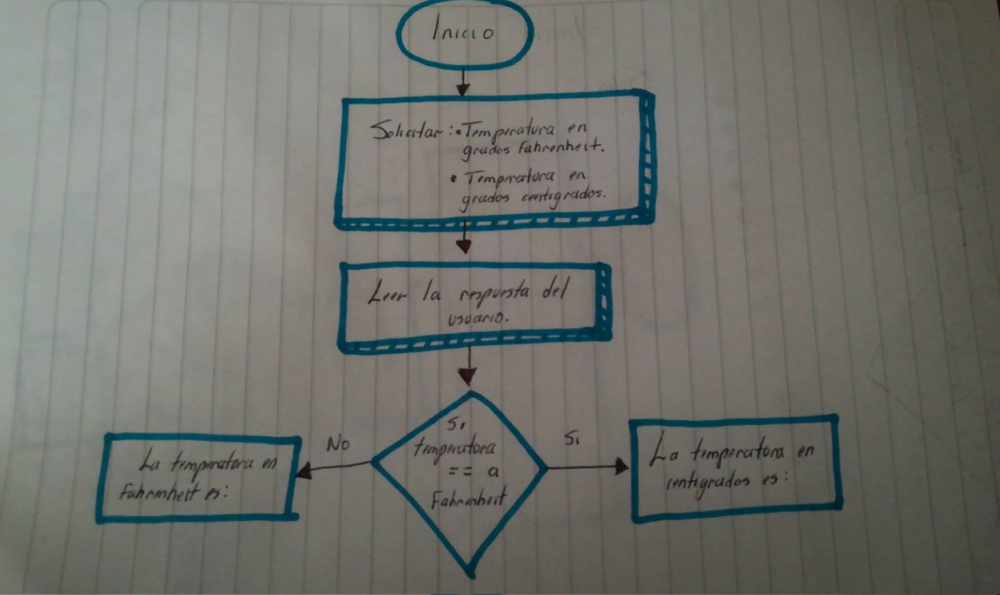

#### Entender el problema: Requerimientos, declaración y salida ejemplo.

Crea un programa que convierta temperaturas de Fahrenheit a Centígrados o de Centígrados a Fahrenheit. Solicita la temperatura inicial. El programa debe solicitar el tipo de conversión y entonces hacer la conversión.

##### Salida ejemplo
Presiona C para convertir de Fahrenheit a Centígrados.

Presiona F para convertir de Centígrados a Fahrenheit.

Tu opción: C

Por favor ingresa la temperatura en Fahrenheit: 32

La temperatura en Centígrados es 0
#### Entradas, proceso y salidas
##### Sustantivos:
* temperatura Fahrenheit (entrada)
* temperatura centigrados (salida)
* temperatura centigrados (entrada)
* temperatura Fahrenheit (salida)
##### Verbos
* convertir
* solicitar
* hacer

#### Dibujar diagrama de flujo



#### Algoritmo en Pseudocódigo
```
Inicializar fahrenheit a ""
Inicializar centigrados a ""
Inicializar temperatura a ""

temperaturaInicial = Solicitar temperatura
gradosFahrenheit = Solictar grados fahrenheit
gradosCentigrados = Solicitar grados centigrados

Si grados == fahrenheit
C = ((temperaturaInicial - 32) * (5 / 9))
"La temperatura en Centigrados es: "

Si grados == centigrados
F = ((temperaturaInicial * (9 / 5)) + 32)
"La temperatura en Fahrenheit es: "
```
