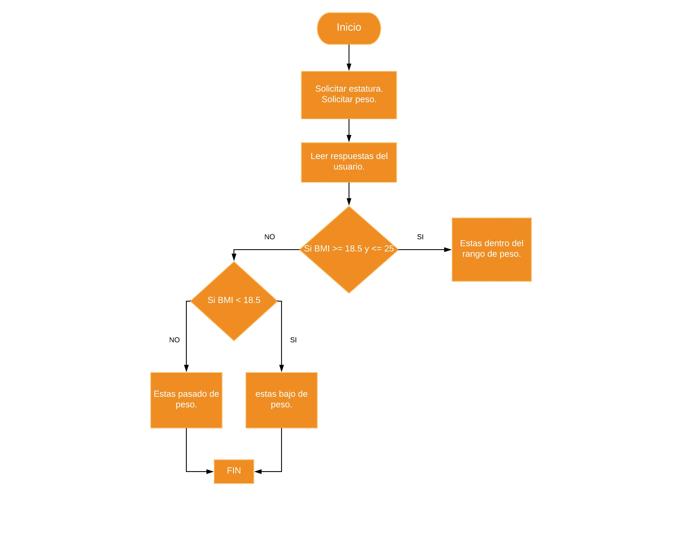

#### Entender el problema: Requerimientos, declaración y salida ejemplo.

Crea un programa que calcule el indice de masa corporal de un persona (BMI) usando la estatura de la persona en pulgadas y el peso en libras. El programa debe solicitar el peso y la estatura del usuario.

##### Salida ejemplo
Tu BMI es 19.5

Estás dentro del rango de peso ideal

o

Tu BMI es 32.5

Estás pasado de peso. Deberías consultar a tu médico.

#### Entradas, proceso y salidas
##### Sustantivos:
* indice de masa corporal (salida)
* estatura (entrada)
* peso (entrada)
##### Verbos
* calcular
* solicitar

#### Dibujar diagrama de flujo



#### Algoritmo en Pseudocódigo
```
Inicializar estatura a ""
Inicializar peso a ""
Inicializar bmi a 0

estaturaUsuario = Solicitar estatura
pesoUsuario = Solicitar peso

Si bmi >= que 18.5 && <= que 25
  bmi = ((pesoUsuario / (estaturaUsuario * estaturaUsuario)) * 703)
  Mostrar "Estás dentro del rango de peso ideal"

Si no bmi < que 18.5
  Mostrar "Estás bajo de peso"

Si no
  Mostrar "Estas pasado de peso"

```
