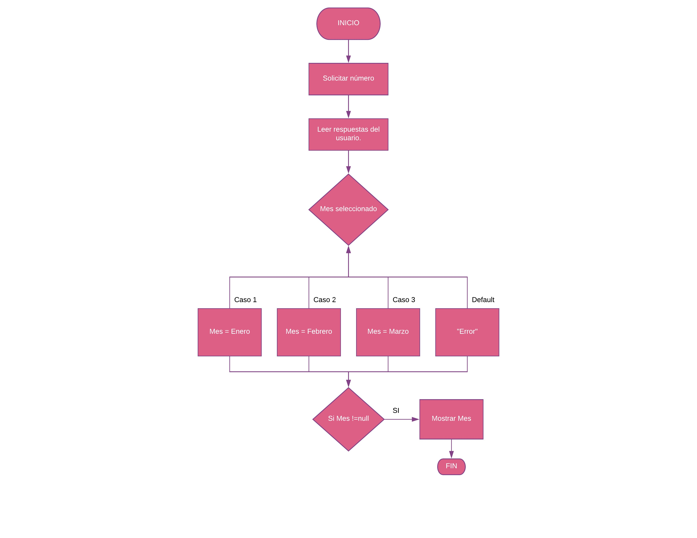

#### Entender el problema: Requerimientos, declaración y salida ejemplo.

Escribe un programa que convierta un número del 1 al 12 al mes que le corresponda. Solicita un número y muestra el mes correspondiente del calendario, empezando con 1 para Enero y terminando con 12 para Diciembre. Para cualquier número fuera del rango, muestra un mensaje apropiado d e error.

##### Salida ejemplo
Por favor ingresa el número del mes: 3

El nombre del mes es Marzo

#### Entradas, proceso y salidas
##### Sustantivos:
* número (entrada)
* mes (salida)
##### Verbos
* convertir
* solicitar
* mostrar

#### Dibujar diagrama de flujo



#### Algoritmo en Pseudocódigo
```
Inicializar numero a ""
Inicializar mes a ""

numeroUsuario = solicitar número

Switch (Mes seleccionado) {
  Case 1:
    Mes = Enero
  [break;]
  Case 2:
    Mes = Febrero
  [break;]
  Case 3:
    Mes = Marzo
  [break;]
  default:
    "Error"

  Si Mes !=null {
    "Mostrar mensaje"
  }
}

```
