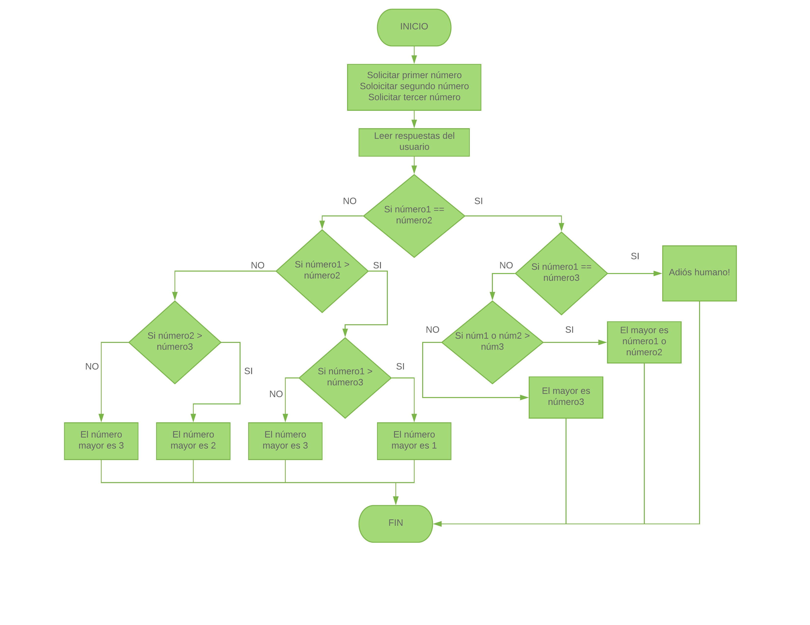

#### Entender el problema: Requerimientos, declaración y salida ejemplo.

Escribe un programa que solicite 3 números. Primero checa si los tres son diferentes. Si lo son, muestra el número más grande de los tres, si no lo son muestra un mensaje despidiéndote del usuario.

##### Salida ejemplo
Ingresa el primer número: 1

Ingresa el segundo número: 52

Ingresa el tercer número: 2

El número más grande es 52

O

Ingresa el primer número: 4

Ingresa el segundo número: 4

Ingresa el tercer número: 4

Adiós, humano el programa ha terminado

#### Entradas, proceso y salidas
##### Sustantivos:
* números (entrada)
* número más grande (salida)
* mensaje de despedida (salida)
##### Verbos
* solicitar
* comparar
* mostrar

#### Dibujar diagrama de flujo



#### Algoritmo en Pseudocódigo
```
INICIO
Inicializar numeroUno a 0
Inicializar numeroDos a 0
Inicializar numeroTres a 0

numeroUno = solicitar primer número
numeroDos = solicitar segundo número
numeroTres = solicitar tercer número

Si numeroUno == que numeroDos
  Si numeroUno == que numeroTres
    Mostrar "Adiós humano"
  Si no Si numeroUno o numeroDos > numeroTres
    Mostrar "El mayor es numeroUno o numeroDos"
    Si no
    Mostrar "El mayor es numeroTres"
Si no Si numeroUno > que numeroDos
    Si numeroUno > que numeroTres
    Mostrar "El número mayor es numeroUno"
    Si no
    Mostrar "El número mayor es numeroTres"
  Si no Si numeroDos > que numeroTres
    Mostrar "El número mayor es numeroDos"
    Si no
    Mostrar "El número mayor es numeroTres"
FinDelSi

FIN

```
